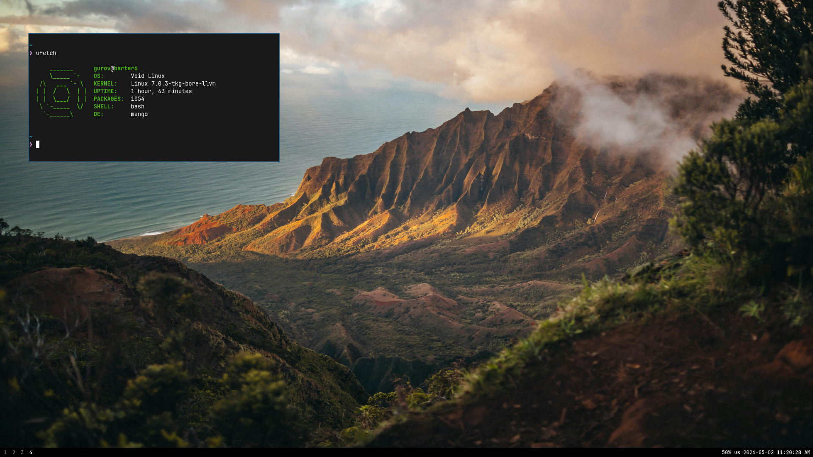

# mangobar

A suckless-esc status bar for mangowc with swaybar energy.



Black strip. Workspace numbers on the left. Volume, layout, and clock on the right. No config format. Patch the source.

The status line is basically a less-native [i3status-dumb](https://github.com/Gur0v/i3status-dumb) built into the bar:

```text
42% us 2026-04-24 09:49:57 PM
```

## What It Is

mangobar is a small Rust bar for mangowc. It shows:

- mangowc tags/workspaces on the left (vacant tags hidden)
- volume, keyboard layout, and clock on the right
- a plain black background
- no extra visual noise

There is no separate `status_command`. The status lives inside the bar.

## How It Works

- `src/mango_ipc.rs` talks to mangowc through `dwl-ipc-unstable-v2` for workspace updates.
- `src/layout.rs` polls `mmsg -g -k` for keyboard layout because mangowc does not currently emit layout changes reliably.
- `src/volume.rs` uses `wpctl get-volume @DEFAULT_AUDIO_SINK@` for volume.
- `src/clock.rs` updates the clock once per second.
- `src/status.rs` renders the right-side status text, similar in spirit to i3status-dumb.
- `src/settings.rs` contains the values people are expected to tweak first.
- `src/main.rs` handles GTK, layer-shell, rendering, clicks, and scroll switching.

## Patching

This project is meant to be patched, not configured. The source is small enough that changing behavior directly is faster than any config format would be.

Start here:

- `src/settings.rs` -- change bar height, font, colors, padding, tag size, and polling intervals.
- `src/status.rs` -- change the right-side status format. This is where `volume layout clock` becomes whatever order or text you want.
- `src/volume.rs` -- change how volume is read. Right now it shells out to `wpctl`.
- `src/layout.rs` -- change keyboard layout behavior. Right now it polls `mmsg -g -k`.
- `src/clock.rs` -- change the clock format or tick behavior.
- `src/main.rs` -- change GTK layout, CSS classes, click behavior, scroll behavior, and workspace rendering.
- `src/mango_ipc.rs` -- change direct mangowc IPC behavior. Most people should not need to touch this unless they want more compositor state.

Recommended workflow:

```sh
make fmt
make check
cargo build --release
```

### Visual tweaks -- `src/settings.rs`

Start here. Everything is a plain constant.

| Constant | What it controls |
| :-- | :-- |
| `BAR_HEIGHT` | Height in pixels |
| `FONT` | CSS font string |
| `BACKGROUND` | Bar background color |
| `FOREGROUND` | Primary text color |
| `DIM_FOREGROUND` | Inactive workspace tag color |
| `LEFT_PADDING` | Left margin of workspace tags |
| `RIGHT_PADDING` | Right margin of status text |
| `TAG_MIN_WIDTH` | Minimum tag button width |
| `TAG_MIN_HEIGHT` | Minimum tag button height |
| `VOLUME_INTERVAL_MS` | How often volume is polled |
| `VOLUME_TIMEOUT_MS` | Max time to wait for `wpctl` |
| `LAYOUT_INTERVAL_MS` | How often keyboard layout is polled |
| `LAYOUT_TIMEOUT_MS` | Max time to wait for `mmsg` |

The CSS is generated in `src/main.rs` from values in `src/settings.rs`, so basic visual tweaks should not require digging through a giant stylesheet.

### Status text -- `src/status.rs`

The `render()` function builds the right-side string. Change the order, add separators, add new fields:

```rust
pub fn render(out: &mut String, volume: VolumeState, layout: LayoutState, time: ClockState) -> String {
    out.clear();
    volume.push_to(out);
    out.push(' ');
    layout.push_to(out);
    out.push(' ');
    time.push_to(out);
    out.clone()
}
```

To remove the layout indicator, delete those two lines. To reorder, move the `push_to` calls around. To add a separator like `|`, push a string literal between fields.

Each state type has a `push_to(out: &mut String)` method that appends its formatted text. To add a new field, create a new state type with a `push_to` impl and wire it up in `spawn_status` in `main.rs`.

### Volume -- `src/volume.rs`

Currently shells out to `wpctl get-volume @DEFAULT_AUDIO_SINK@`. To switch to `pactl` or `amixer`, replace the `current()` async function and update `parse()` to handle the new output format.

```rust
async fn current() -> Result<VolumeState, String> {
    let out = Command::new("wpctl")
        .args(["get-volume", "@DEFAULT_AUDIO_SINK@"])
        .output()
        .await
        .map_err(|err| err.to_string())?;
    // ...
}
```

### Clock -- `src/clock.rs`

The format string is at the top of the file:

```rust
const CLOCK_FORMAT: &[u8] = b"%Y-%m-%d %I:%M:%S %p\0";
const CLOCK_LEN: usize = 22;
```

`CLOCK_FORMAT` is a standard `strftime` format. When you change it, update `CLOCK_LEN` to match the maximum byte length of your new format string or the output will be truncated.

### Keyboard layout -- `src/layout.rs`

Polls `mmsg -g -k` on an interval because the IPC event path does not emit layout changes reliably. The `parse()` function reads the `kb_layout` field from `mmsg` output.

The layout-to-short-code mapping lives in `LayoutState::from_name()` in `src/status.rs`. Add entries there if your layout names are not matched:

```rust
pub fn from_name(name: &str) -> Self {
    if name.contains("English (US)") {
        return Self::from_ascii("us");
    }
    if name.contains("Russian") {
        return Self::from_ascii("ru");
    }
    // add your own here
}
```

### Workspace appearance and behavior -- `src/main.rs`

`render_tags()` controls which tags are shown and what CSS classes they get. `scroll_target()` controls scroll-to-switch behavior. The CSS is generated inline from `src/settings.rs` values inside `install_css()`.

## Porting to another WM

The IPC layer is isolated from the rest of the bar. Here is what you would need to replace.

### Workspace events -- `src/mango_ipc.rs`

This file speaks `dwl-ipc-unstable-v2` over Wayland. It receives tag and layout events from mangowc and sends them as `MangoEvent::Tags` and `MangoEvent::Layout` over an `mpsc` channel.

To port to another compositor:

1. Replace the protocol XML in `protocols/` with your compositor's IPC protocol, if it has one.
2. Rewrite `mango_ipc.rs` to connect to your compositor and produce the same `MangoEvent` variants.
3. If your compositor has no Wayland IPC protocol, replace the whole thing with something that reads from a socket or polls a CLI tool and sends `MangoEvent` values.

The rest of the bar does not know how workspace data arrives. It only consumes `MangoEvent`.

### Keyboard layout -- `src/layout.rs`

Replace the `mmsg` call in `current()` with whatever your compositor or input stack exposes. The function just needs to return a `LayoutState`.

### Workspace switching

`switch_tag()` in `main.rs` calls `mmsg -s -t <n>`. Replace it with your compositor's equivalent.

### Layer shell

mangobar uses `gtk4-layer-shell` to anchor itself to a screen edge. This is Wayland-only but works with any wlroots-based compositor, not just mangowc. If you are targeting X11, you would replace the layer-shell setup in `build_window()` with a different window positioning approach.

## Source Map

| Goal | File |
| :-- | :-- |
| Change colors/font/height/spacing | `src/settings.rs` |
| Change workspace visibility or click behavior | `src/main.rs` |
| Change scroll behavior | `src/main.rs` |
| Change status order/text | `src/status.rs` |
| Change volume command/parsing | `src/volume.rs` |
| Change keyboard layout command/parsing | `src/layout.rs` |
| Change clock format | `src/clock.rs` |
| Add more mangowc IPC state | `src/mango_ipc.rs` |
| Update generated IPC protocol | `protocols/dwl-ipc-unstable-v2.xml` |

## Controls

- Click a workspace number to switch to it.
- Scroll over the bar to move between visible workspaces.
- Vacant tags are hidden.

## Build

Void dependencies:

```sh
sudo xbps-install -S rust cargo gtk4 gtk4-devel gtk4-layer-shell gtk4-layer-shell-devel gdk-pixbuf gdk-pixbuf-devel wireplumber
```

You also need mangowc's `mmsg` in `PATH`.

Build:

```sh
cargo build --release
# or
make build
```

Install:

```sh
sudo install -Dm755 target/release/mangobar /usr/local/bin/mangobar
# or
sudo make install
```

Useful development commands:

```sh
make fmt
make check
make run
make clean
```

## Run

Inside mangowc:

```sh
./target/release/mangobar
```

For one output:

```sh
./target/release/mangobar --output DP-1
```

## Scope

Supported:

- mangowc (and compatible `dwl-ipc-unstable-v2` compositors)
- GTK4 + Wayland layer-shell
- PipeWire/WirePlumber via `wpctl`

Not the goal:

- a general-purpose bar framework
- a theme engine or config format
- a widget garden
- supporting every compositor out of the box

## License

[GPL-3.0](LICENSE)
